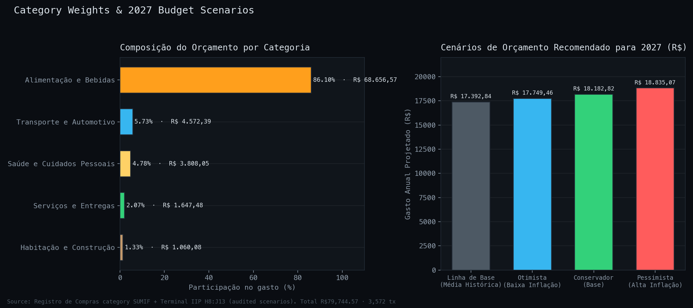

# Category Inflation & 2027 Budget

Sector-by-sector breakdown of the R$79,744.57 tracked in `Registro de
Compras` (3,572 transactions, 2022–2026), and the three 2027 budget
scenarios modeled in the `Terminal IIP` sheet.

The chart (dark terminal style) shows the ledger budget-weight vector on the left
and the audited 2027 scenario budgets on the right — the two figures this report
is built around.

---

## 1. Budget weight vector

| Categoria | Total Gasto | Participação | Notes |
|---|---:|---:|---|
| Alimentação e Bebidas | R$68,656.57 | **86.10%** | dominated by Supermercado Litoral (94.11% of all spend); see item-level outliers below |
| Transporte e Automotivo | R$4,572.39 | 5.73% | second-largest category, no single dominant merchant |
| Saúde e Cuidados Pessoais | R$3,808.05 | 4.78% | mostly personal-care items bought at Litoral alongside groceries |
| Serviços e Entregas | R$1,647.48 | 2.07% | Taxa de Entrega appears 110 times, the highest-frequency line item in the ledger |
| Habitação e Construção | R$1,060.08 | 1.33% | smallest category, occasional purchases (e.g. Leroy Merlin) |
| **Total Geral** | **R$79,744.57** | **100.00%** | |

**Read:** this is functionally a food-and-beverage index with four small
satellite categories. Any inflation-mitigation effort has to target
Alimentação e Bebidas to move the needle — the other four categories
combined are under 14% of spend.

---

## 2. Sector commentary

**Alimentação e Bebidas (86.10%).** The category driving the whole IIP
(see `personal_inflation_index.md`). Concentrated almost entirely at
Supermercado Litoral. The `05_Comparisons/manaira_vs_litoral_price_comparison.md`
benchmark shows Manaíra runs ~6.3% cheaper on average on the coincident
basket, and ~10.2% cheaper specifically on hortifrúti (produce) — the
single highest-leverage lever available in this category.

**Transporte e Automotivo (5.73%).** Not itemized in the price watchlist;
no per-SKU inflation read available from the current ledger structure.
Flagged as a gap — if this category becomes material to future analysis,
it needs its own item-level tracking the way groceries have.

**Saúde e Cuidados Pessoais (4.78%).** Two watchlist items here — Desodorante
Axe Marine (+64.5%, 2022→2026) and toothpaste/soap SKUs added in the
Sep/2026 batch — both above the market benchmark's cumulative rate.
Personal-care inflation is tracking closer to food than to a typical
non-food basket.

**Serviços e Entregas (2.07%).** Taxa de Entrega: R$11.00 (2022) →
R$18.00 (2026), +63.6%, the highest-frequency recurring charge in the
ledger (110 occurrences). Small in R$ terms but worth watching — a fixed
per-order fee rising faster than food prices erodes the value of
small-basket deliveries specifically.

**Habitação e Construção (1.33%).** Smallest and least frequent category;
no meaningful trend signal with the current sample size.

---

## 3. 2027 budget scenarios

Baseline annualized expenditure: **R$17,392.84**.

| Scenario | IIP Rate | Market Rate | 2027 Budget | Δ Annual |
|---|---:|---:|---:|---:|
| Otimista | +2.00% | +2.00% | R$17,749.46 | +R$356.62 |
| **Conservador** (active, cell `I9`) | **+5.00%** | +3.50% | **R$18,182.82** | **+R$789.98** |
| Pessimista | +8.00% | +6.00% | R$18,835.07 | +R$1,442.23 |

The three cases bracket a **R$1,085.61** swing on next year's grocery-heavy
budget (Pessimista − Otimista).

**Risk read:** 2026 YTD is already running at +7.50% YoY (see
`personal_inflation_index.md`) — closer to the Pessimista case (+8.00%)
than to the active Conservador assumption (+5.00%). If that run-rate holds
through year-end, Conservador likely understates 2027 required budget by
several hundred reais. Worth revisiting this table once the full 2026 year
closes.

---

## 4. Risk-mitigation playbook

1. **Store-switch on produce.** Hortifrúti is where Manaíra's price
   advantage is largest (~10.2% average, up to −35.9% on banana-prata).
   Since Alimentação carries 86% of the weight vector, this single change
   has more budget impact than any move in the other four categories
   combined.
2. **Watch the six-item price list, not just the aggregate.** Cenoura KG
   (+150.4%), Café (+81.4%), and Taxa de Entrega (+63.6%) are each moving
   2–5x faster than the market benchmark. A short recurring check against
   `iip_terminal.html` → Watchlist tab catches a runaway item early.
3. **Re-baseline the 2027 scenario once 2026 closes.** The Conservador
   case (+5.00%) was set before the ledger showed a +7.50% YTD run-rate;
   treat the R$18,182.82 budget figure as provisional until year-end
   actuals are in.
4. **Don't let Taxa de Entrega erode small-basket economics.** At +63.6%
   growth against food's +40–150% range, delivery fees are becoming a
   larger relative cost of small/urgent purchases — consolidate orders
   where practical.

---

## Data notes

Category totals recomputed directly from `Registro de Compras` (03/09/2026
refresh). The 2027 scenario table (IIP Rate, Market Rate, Budget columns)
is the audited figure from `Terminal IIP` H8:J13 — not recomputed here.

*Generated: 2026-09-03.*
