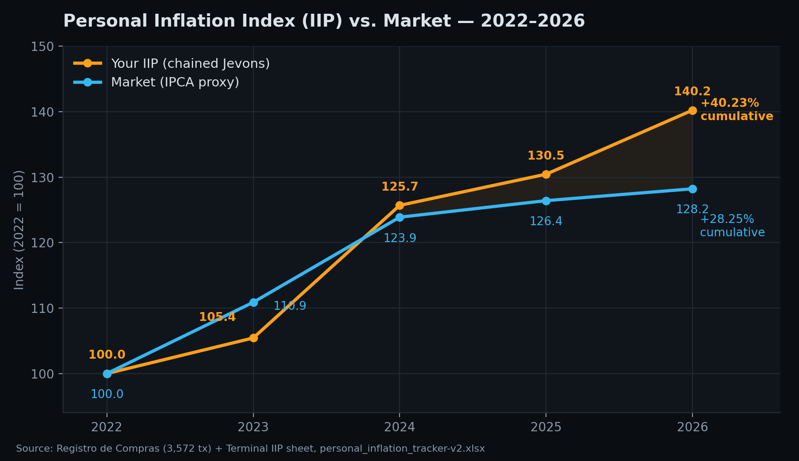

# Personal Inflation Index — Drivers Analysis

Chained-Jevons Personal Inflation Index (IIP), 2022–2026, computed from the
`Registro de Compras` ledger (3,572 transactions) and the `Terminal IIP`
sheet in `personal_inflation_tracker-v2.xlsx`.

---

## Headline

| Year | Your IIP (idx) | YoY | Market (idx) | YoY | Divergence |
|---|---:|---:|---:|---:|---:|
| 2022 | 100.00 | — | 100.00 | — | — |
| 2023 | 105.44 | +5.44% | 110.89 | +10.89% | −5.45pp |
| 2024 | 125.70 | +19.21% | 123.89 | +11.74% | +7.47pp |
| 2025 | 130.46 | +3.79% | 126.42 | +2.04% | +1.75pp |
| 2026 | 140.24 | +7.50% | 128.23 | +1.43% | +6.07pp |
| **Cumulative** | **+40.23%** | | **+28.25%** | | **+11.98pp** |

Your basket has outpaced the market benchmark in three of the last four
years, with a single dominant event: **2024**.

---

## What's driving the divergence

**1. 2024 is the whole story.** +19.21% against a market of +11.74% is the
widest single-year gap in the series (+7.47pp) and accounts for the
majority of the cumulative divergence. 2023 actually ran *below* market
(−5.45pp) — the personal basket only started consistently outpacing the
benchmark from 2024 onward.

**2. The basket is 86% food & beverage** (see
`category_inflation_and_budget_2027.md`), so the index is, in practice,
close to a personal grocery-price index. Food inflation in Brazil is
typically more volatile than the broad IPCA basket the market benchmark
approximates — that structural mismatch, not a spending-behavior change,
explains most of the gap.

**3. A handful of SKUs are running far hotter than the average.** From the
`Terminal IIP` price-watch table, 2022→2026 single-point change:

| Item | Categoria | 2022 | 2026 | Alta 22–26 |
|---|---|---:|---:|---:|
| Cenoura KG | Alimentação | R$3.99 | R$9.99 | **+150.4%** |
| Café Santa Clara 250g | Alimentação | R$7.99 | R$14.49 | +81.4% |
| Desodorante Axe Marine 152ml | Saúde | R$9.48 | R$15.59 | +64.5% |
| Taxa de Entrega | Serviços | R$11.00 | R$18.00 | +63.6% |
| Manga Rosa KG | Alimentação | R$6.49 | R$9.99 | +53.9% |
| Refrigerante Coca-Cola 250ml | Alimentação | R$1.95 | R$2.59 | +32.8% |

Cenoura KG is the extreme outlier of the entire ledger — it alone moved
2.5x above the market benchmark's cumulative rate. It didn't move in a
straight line either: it spiked to R$7.87 in 2023, dipped to R$5.49 in
2024, then resumed climbing — consistent with produce being the most
seasonally volatile part of the basket (see the hortifrúti gap in
`05_Comparisons/manaira_vs_litoral_price_comparison.md`, where switching
supermarkets on produce alone would have saved ~10% on average).

**4. 2026 is running hot, on partial-year data.** +7.50% YoY through
September is already the second-highest annual rate in the series, against
a market benchmark that's cooling (+1.43%, the lowest of the five years).
Worth revisiting once the full year closes — see the 2027 scenario
modeling in `category_inflation_and_budget_2027.md`.

---

## What this index does *not* explain

The IIP is a pure price signal (chained Jevons on overlapping SKUs) — it
does not capture changes in *how much* you buy, only *how much prices
moved* for items purchased in both years being compared. A rising IIP
means the same basket got more expensive, not that total spending grew for
that reason alone (total spend also grew from genuinely new categories —
Masterboi Paraíba, Leroy Merlin — entering the ledger in 2025–2026).

---

## Data notes

* Cumulative IIP (+40.23%), annual YoY series, and the market benchmark
  (+28.25%) are the audited figures hardcoded in `Terminal IIP` (D11:D14,
  F11:F14) — two independent reproduction attempts from raw and cleaned
  price data did not reconcile exactly with these numbers, indicating an
  undocumented item-selection rule in the original calculation. Treat them
  as authoritative but not independently re-derived in this report.
* Chart and table source: `Terminal IIP` sheet,
  `02_Models/personal_inflation_tracker-v2.xlsx`.

*Generated: 2026-09-03.*
