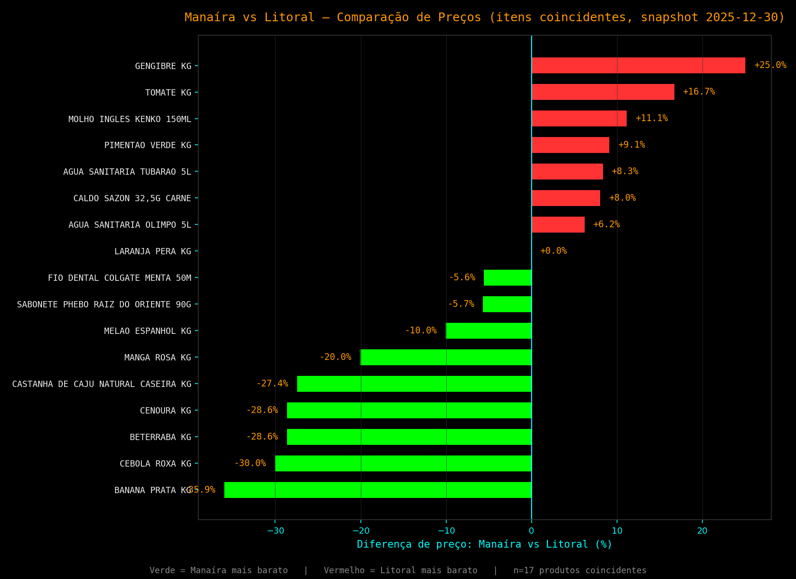

# Manaíra vs. Litoral: Comparação de Preços (Snapshot 2025-12-30)

Comparação de preços entre **Supermercados Manaíra** (CNPJ `09.143.892/0001-54`) e **Supermercado Litoral** (CNPJ `08.189.400/0001-07`), usando um snapshot completo de notas fiscais da Manaíra emitidas em **30/12/2025** contra os preços mais próximos disponíveis no histórico de preços do Litoral.

> **Nota de escopo**: este relatório é uma análise de **preços de mercado** (dados públicos de notas fiscais), separada da sua planilha de gastos pessoais. Nenhuma transação da Manaíra foi adicionada ao `Registro de Compras` do tracker — os 4.806 cupons fiscais do dia 30/12/2025 pertencem a diversos consumidores, não só a você.

---

## Principais Descobertas

1. **Cesta comparável restrita**: dos 8.947 produtos distintos vendidos na Manaíra naquele dia, apenas **17** têm equivalência exata de nome/unidade com um registro do Litoral **em até 120 dias** da data do snapshot — a maioria (13 de 17) com registro do Litoral no próprio dia 29-30/12/2025.
2. **Manaíra em média mais barata na cesta coincidente**: variação média de **-6,32%** (mediana -5,56%) frente ao Litoral. De 17 itens, a Manaíra foi mais barata em **9**, o Litoral em **7**, e **1** empatou.
3. **Hortifrúti é onde a diferença é maior**: nas 10 frutas/verduras comparáveis, a Manaíra ficou em média **-10,24%** mais barata (chegando a -35,94% na banana-prata e -30,03% na cebola roxa). A castanha de caju também ficou -27,41% mais barata na Manaíra.
4. **Higiene/limpeza e mercearia, mistos**: nesses itens (água sanitária, sabonete, fio dental, caldo, molho inglês) a diferença é pequena e sem direção clara (+0,83% e +9,58% em média, respectivamente) — praticamente equivalência de preço.

---

## Tabela Completa (17 itens coincidentes)

| Produto | Unidade | Preço Manaíra | Preço Litoral | Diferença | Data ref. Litoral |
|:---|:---:|---:|---:|---:|:---:|
| BANANA PRATA KG | KG | R$ 4,99 | R$ 7,79 | **-35,94%** | 13/01/2026 |
| CEBOLA ROXA KG | KG | R$ 6,99 | R$ 9,99 | **-30,03%** | 13/01/2026 |
| BETERRABA KG | KG | R$ 4,99 | R$ 6,99 | **-28,61%** | 29/12/2025 |
| CENOURA KG | KG | R$ 4,99 | R$ 6,99 | **-28,61%** | 29/12/2025 |
| CASTANHA DE CAJU NATURAL CASEIRA KG | KG | R$ 97,99 | R$ 134,99 | **-27,41%** | 29/12/2025 |
| MANGA ROSA KG | KG | R$ 7,99 | R$ 9,99 | -20,02% | 29/12/2025 |
| MELÃO ESPANHOL KG | KG | R$ 4,49 | R$ 4,99 | -10,02% | 13/01/2026 |
| SABONETE PHEBO RAIZ DO ORIENTE 90G | UN | R$ 4,99 | R$ 5,29 | -5,67% | 18/12/2025 |
| FIO DENTAL COLGATE MENTA 50M | UN | R$ 16,99 | R$ 17,99 | -5,56% | 30/11/2025 |
| LARANJA PERA KG | KG | R$ 2,99 | R$ 2,99 | 0,00% | 03/09/2025 |
| ÁGUA SANITÁRIA OLIMPO 5L | UN | R$ 11,99 | R$ 11,29 | +6,20% | 13/01/2026 |
| CALDO SAZÓN 32,5G CARNE | UN | R$ 2,69 | R$ 2,49 | +8,03% | 27/10/2025 |
| ÁGUA SANITÁRIA TUBARÃO 5L | UN | R$ 12,99 | R$ 11,99 | +8,34% | 29/12/2025 |
| PIMENTÃO VERDE KG | KG | R$ 11,99 | R$ 10,99 | +9,10% | 29/12/2025 |
| MOLHO INGLÊS KENKO 150ML | UN | R$ 4,99 | R$ 4,49 | +11,14% | 13/01/2026 |
| TOMATE KG | KG | R$ 6,99 | R$ 5,99 | +16,69% | 29/12/2025 |
| GENGIBRE KG | KG | R$ 19,99 | R$ 15,99 | +25,02% | 29/12/2025 |

---

## Metodologia

* **Fonte Manaíra**: `manaira01.csv` (4.806 NFC-e emitidas em 30/12/2025, `SUPERMERCADOS MANAIRA LTDA`, CNPJ `09.143.892/0001-54`) — dados públicos de notas fiscais, não transações pessoais. 78.787 linhas de item extraídas do campo `det` de cada nota; preço por produto = **mediana** do preço unitário entre todos os cupons do dia.
* **Fonte Litoral**: `Price_History_part_1_of_5.csv` a `_5_of_5.csv`, filtrados por CNPJ do Litoral, apenas registros marcados `is_comparable = True` (exclui fardos/embalagens coletivas, mesmo critério do `litoral_price_analysis.md`).
* **Pareamento**: nome do produto (normalizado, maiúsculas) + unidade de medida (`uCom`/`uom_com`) idênticos entre as duas fontes. Para cada produto pareado, usou-se o registro do Litoral com data mais próxima do snapshot da Manaíra (30/12/2025), limitado a uma janela de **120 dias** para evitar comparar contra preços desatualizados.
* **Limitação principal**: a Manaíra só tem dado de **um único dia**; muitos produtos do dia não têm equivalente recente no histórico do Litoral (nomenclatura/marca diferente ou sem registro na janela de 120 dias), o que reduz a amostra comparável a 17 produtos — suficiente para uma leitura direcional (hortifrúti mais barato na Manaíra), não para um índice geral como o do Litoral.

---
*Gerado em: 2026-09-03. Nenhum dado da Manaíra foi incluído no tracker de gastos pessoais.*
